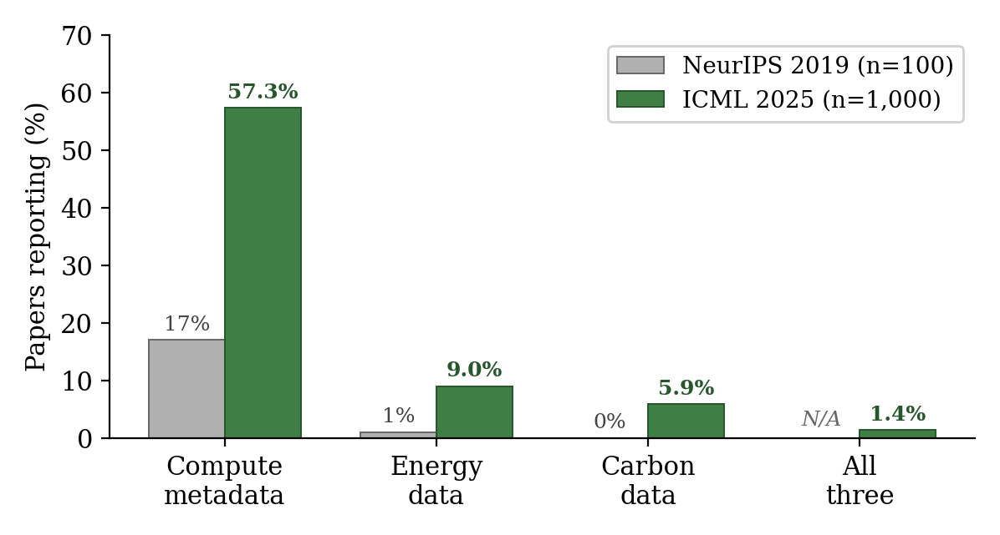
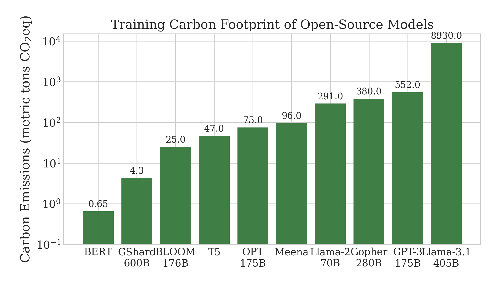
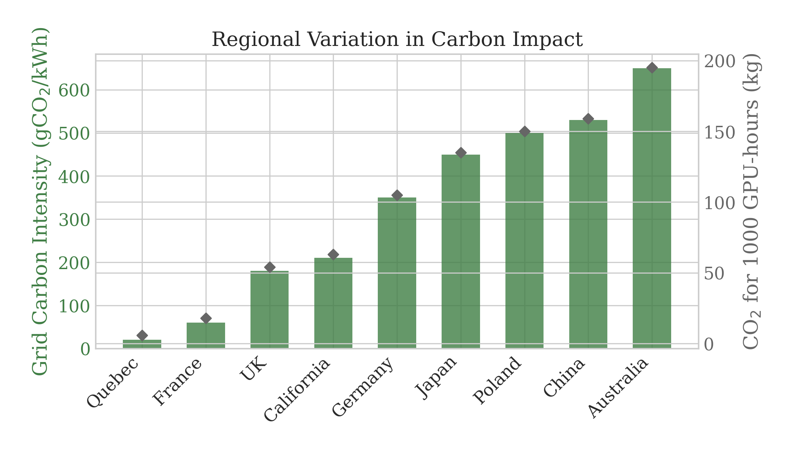

# Position: Carbon Footprint Reporting Should Be Routine in Machine Learning Research

Accepted to ICML 2026 Position Paper Track. Go check out our [paper](paper/carbon_position_paper.pdf)! 🎉

We argue that standardized carbon footprint reporting should be a routine component of ML publications. Without energy and emissions metrics, claims of model efficiency are incomplete, since identical experiments in different locations can yield vastly different carbon footprints.

## Key Findings

1. **The compute-vs-carbon gap is real and measurable.** A survey of 1,000 ICML 2025 accepted papers shows compute metadata reporting at 57.3%, energy at 9.0%, carbon at 5.9%, and all three together at 1.4%.
2. **Compute reporting tripled in six years** (17% → 57.3%) after NeurIPS 2019's reproducibility checklist, with no formal mandate. Energy and carbon reporting today resemble compute reporting circa 2019.
3. **The same kWh is not the same carbon.** Grid intensity varies ~30× across regions (Quebec ~20 gCO₂/kWh vs. Australia ~650 gCO₂/kWh), so location-blind efficiency claims are unfalsifiable.
4. **Disclosed training emissions span four orders of magnitude.** BERT (0.65 t), BLOOM (25 t), GPT-3 (552 t), Llama-3.1 405B (8,930 t) — yet most papers report none of this.

## Results

### Carbon reporting gap (NeurIPS 2019 vs. ICML 2025)

Compute reporting is now common; energy and carbon reporting remain rare. The same checklist-style intervention that lifted compute reporting can close the gap.



### Training carbon by model & regional grid intensity

Disclosed training emissions span four orders of magnitude (BLOOM 25 t on France's low-carbon grid vs. Llama-3.1 405B at 8,930 t). Grid carbon intensity itself varies ~30× across regions, so dual reporting (energy and carbon) plus reference-grid normalization are necessary for fair comparison.

<p align="center">
  
  
</p>

## Survey

We sampled **1,000 of 3,260 accepted ICML 2025 papers** via OpenReview and ran keyword matching with manual verification across three categories:

| Category | Example keywords | ICML 2025 | NeurIPS 2019 |
|---|---|---|---|
| Compute metadata | GPU type, GPU-hours, training time, FLOPs | 57.3% | 17% |
| Energy data | kWh, power draw, CodeCarbon, Carbontracker | 9.0% | 1% |
| Carbon data | CO₂, carbon footprint, GHG, kgCO₂e | 5.9% | 0% |
| All three | — | 1.4% | N/A |

NeurIPS 2019 baseline is from Henderson et al. (2020), n=100.

Pipeline: OpenReview sample → keyword search → paragraph-level extraction → false-positive filter → per-paper report. Outputs in `data/`:

- `carbon_survey_results.csv` — one row per paper, three boolean reporting flags
- `detailed_analysis.{csv,json}` — paragraph-level matches with section context (4 MB / 3 MB)
- `detailed_analysis_clean.csv` — same, after false-positive filtering
- `detailed_report.md` — human-readable per-paper findings (~1.5 MB)

The raw PDF corpus (~2.9 GB, 695 papers) is not redistributed; pre-computed outputs in `data/` are sufficient to inspect or extend the findings.

## Proposal

Five standardized fields, three adoption stages:

- **Fields:** energy (kWh), carbon (kgCO₂e), grid intensity (gCO₂/kWh), PUE, geographic location.
- **Stages:** *(i)* opt-in templates, *(ii)* mandatory disclosure with reviewer prompts, *(iii)* benchmark integration with accuracy × carbon Pareto fronts.

[`src/report_carbon.py`](src/report_carbon.py) is a minimal illustrative decorator showing how authors could emit the five fields in a uniform footer. It is a stub, real backends (CodeCarbon, Carbontracker, nvidia-smi) would supply the numbers:

```python
@report_carbon(energy_kwh=85.2, grid_intensity_gco2_per_kwh=350, pue=1.2, location="Frankfurt, DE")
def train():
    ...
# [Carbon Report] train
#   Energy:          85.20 kWh
#   Carbon:          35.78 kgCO2e
#   Grid intensity:  350 gCO2/kWh
#   PUE:             1.2
#   Location:        Frankfurt, DE
```

## Repository

- `paper/` — LaTeX source, figures, compiled PDF
- `src/` — survey + per-paper analysis pipeline
- `data/` — survey outputs (CSV/JSON + per-paper markdown report)
- `src/report_carbon.py` — illustrative decorator for the proposed reporting format
- `docs/` — camera-ready notes, survey quickstart
- `assets/` — README figures

## Scripts

```bash
# Install dependencies (creates .venv via uv)
uv sync

# Survey ICML 2025 accepted papers (keyword search via OpenReview)
uv run python src/survey_carbon_reporting.py

# Paragraph-level extraction (requires matched_pdfs/ corpus, ~2.9 GB, not redistributed)
uv run python src/detailed_analysis.py
uv run python src/generate_report.py

# Regenerate paper figures
uv run python paper/generate_figures.py
uv run python paper/generate_reporting_gap.py

# Rebuild the paper
cd paper && latexmk -pdf carbon_position_paper.tex
```

## Citation

```bibtex
@inproceedings{chiu2026carbon,
  title     = {Position: Carbon Footprint Reporting Should Be Routine in Machine Learning Research},
  author    = {Chiu, Guan-Ming},
  booktitle = {Proceedings of the 43rd International Conference on Machine Learning},
  year      = {2026},
  note      = {Position Paper Track}
}
```
